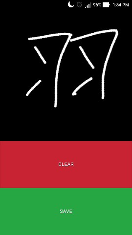
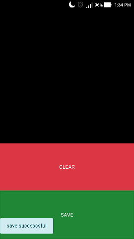
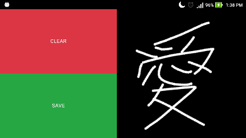

# Handwriting Canvas

## Description

- This is a `cordova` application for writing and saving handwritten characters. I used it for learning and collecting Japanese kanji data.

**Sample**






## Getting started

### Requirements:

- [nodejs](https://nodejs.org)
- [cordova](https://cordova.apache.org/) or [PhoneGap](https://phonegap.com/): `npm install -g cordova`

### Setting up and running the project

- Create a blank cordova project

```bash
cordova create [folder-name] [com.example.cordova] [app-name]
```

- Replace the `www` folder content with this repository `www`

- Add your platform of choice. For example, `cordova platform add android`

    - You will need to install some addition softwares depend on your targeting platform (`android` will need `Android Studio` and an `Android SDK` version)

- Add `cordova-plugin`

    - [`Canvas2ImagePlugin`](https://github.com/kuroemon2509/Canvas2ImagePlugin):

        ```bash
        cordova plugin add https://github.com/kuroemon2509/Canvas2ImagePlugin.git
        ```

- `build` or `run` it in your devices

    - Build for android platform: `cordova build android`

    - Or run on android device: `cordova run android`

### Note

- On `android` device, images will be saved at `/root/sdcard/Pictures/cordova_app/`.

- [Pre-build apk](https://github.com/kuroemon2509/handwriting_canvas/releases) is availabled at releases.

- If your purpose is to run Tensorflow model inference via `tensorflow.js`, it's *not* possible because `tensorflow.js` use `Web Worker API` to pull its assets from the server the web page is running. However, cordova application is just offline `html-viewer` with offline `javascript`.